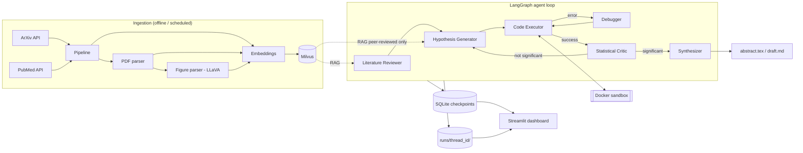

# Architecture: Autonomous Multimodal Scientific Discovery Agent

## 1. Goal

A self-directed AI researcher that, with no human in the loop:

1. ingests recent ArXiv and PubMed papers (text + figures) into a vector database,
2. forms novel hypotheses grounded in peer-reviewed literature,
3. writes experiment code and runs it in a secure Docker sandbox, debugging itself on failure,
4. checks the results for statistical significance, and
5. writes the findings up as a LaTeX abstract and a research draft.

Humans only observe, through a Streamlit dashboard.

## 2. Tech stack

| Concern | Choice | Why |
|---|---|---|
| Language | Python 3.12 | Whole team, every library |
| Orchestration | **LangGraph** (LangChain) | Explicit state machine, native loops for self-debugging, SQLite checkpointing for multi-day runs |
| LLM | Provider-agnostic via `init_chat_model` | Set `LLM_MODEL` in `.env`: Claude, OpenAI or local Ollama |
| Vision | LLaVA (via Ollama) behind `get_vlm()` | Parses charts and graphs from PDFs |
| Vector DB | **Milvus** standalone (docker compose) | Free; identical local instance for each teammate |
| Embeddings | sentence-transformers `all-MiniLM-L6-v2` (384-d) | Runs locally on CPU, no API key needed |
| Literature APIs | `arxiv`, NCBI Entrez (`biopython`) | Official APIs |
| PDF parsing | PyMuPDF | Text and image extraction |
| Sandbox | Docker SDK + hardened `python:3.12-slim` image | Isolated execution of untrusted generated code |
| Statistics | scipy, statsmodels | Deterministic significance testing |
| Dashboard | Streamlit | Fast to build, Python-native |
| Quality | ruff, pytest, pre-commit, GitHub Actions | Same checks locally and in CI |

## 3. System overview



## 4. Components

### 4.1 Ingestion (`ingestion/`, `retrieval/`)
- `arxiv_client.fetch_arxiv` and `pubmed_client.fetch_pubmed` return `Paper` objects.
  ArXiv papers have `peer_reviewed=False`; PubMed journal articles have `peer_reviewed=True`.
- `pipeline.run_ingestion` fetches, deduplicates by `Paper.id`, chunks, embeds and upserts.
  It is **idempotent**, so it can run on a schedule (cron / Task Scheduler) to keep the DB current.
- From Week 3, `pdf_parser` pulls body text and figures, and `figure_parser` uses the VLM to
  describe each chart (type, axes, trend, key values) as a `kind="figure"` chunk.
- The Milvus collection `papers` has the fields `id, paper_id, kind, source, peer_reviewed,
  published_ts, text, vector(384)`, with a scalar index on `peer_reviewed` for filtered RAG.

### 4.2 Agent graph (`graph/`, `agents/`)
Every node is a pure function `node(state: ResearchState) -> dict` (a partial state update).
The full state is defined in [`graph/state.py`](src/discovery_agent/graph/state.py).

| Node | Reads | Writes |
|---|---|---|
| `literature_reviewer` | `topic` | `literature`, `literature_summary` |
| `hypothesis_generator` | `literature`, `critic_report` (on refine) | `hypothesis` |
| `code_executor` | `hypothesis`, `code` | `code`, `attempts[+]` |
| `debugger` | `attempts` | `code`, `debug_iteration` |
| `critic` | last `attempts.result` | `critic_report` |
| `synthesizer` | everything | `abstract_latex`, `draft_markdown` |

Every node also appends to `trace` (for the dashboard's logic tree) and `costs`.

**Routing**
- `route_after_execution`: on failure with `debug_iteration < MAX_DEBUG_ITERATIONS`, go to
  `debugger`; on success, go to `critic`; once the budget is spent, go to `END (failed)`.
- `route_after_critic`: if `significant`, go to `synthesizer`; otherwise go back to
  `hypothesis_generator` with the critic's feedback, capped at 3 refinements.

**Grounding rule:** every `Citation.paper_id` in a `Hypothesis` must exist in
`state["literature"]` and be `peer_reviewed=True`. Otherwise the generator retries.

### 4.3 Secure sandbox (`sandbox/`)
The generated code is untrusted. `runner.run_code` writes it to `runs/<id>/attempt_<n>/main.py`
and runs it in `discovery-sandbox:latest` with:

| Control | Setting |
|---|---|
| Network | `network_disabled=True` |
| Filesystem | `read_only=True`; code mounted read-only at `/workspace`; only `/output` writable; `tmpfs /tmp` |
| Privileges | non-root uid 10001, `cap_drop=["ALL"]`, `no-new-privileges` |
| Resources | `mem_limit` 2g, `nano_cpus` 1 CPU, `pids_limit` 128 |
| Time | wall-clock timeout, then the container is killed and removed |
| Interpreter | `python -I` (isolated mode) |

The contract for experiments: code writes its results to `/output/metrics.json`
(e.g. `{"test": "t-test", "p_value": 0.01, "ci_95": [0.1, 0.4], "effect_size": 0.6, "n": 200}`)
and any plots to `/output/*.png`.
All dependencies are baked into the image, because there is no network at runtime.

### 4.4 Self-debugging RL feedback loop (`sandbox/feedback.py`, `agents/debugger.py`)
- Each execution produces a scalar **reward** (shaping table in `feedback.py`) and an
  **error class** (`syntax/import/runtime/timeout/oom`).
- The debugger receives the code, the truncated stderr, the error class and the attempt
  history, then rewrites the code.
- Repair strategies (e.g. "minimal patch", "rewrite from scratch", "simplify the experiment")
  are chosen by an epsilon-greedy **bandit** whose values are learned from rewards and
  persisted across runs in `runs/bandit.json`. This is the RL component: the policy for
  picking a strategy improves with experience.
- Each `CodeAttempt` is logged with its reward, which the dashboard shows as a learning curve.

### 4.5 Statistical Critic (`agents/critic.py`)
1. **Deterministic stage:** parse `metrics.json`, recompute or validate p-values and CIs
   with scipy where the raw data is present, apply Holm-Bonferroni across multiple tests,
   flag n < 30, missing effect sizes, and p-values without a named test.
2. **LLM stage:** review the methodology (leakage, confounders, whether the test matches
   the hypothesis). The LLM can add issues but **cannot override** numbers from stage 1.
3. Output: a `CriticReport` with the verdict `significant | not_significant | invalid`.

### 4.6 Memory and long runs (`memory/`)
- A LangGraph `SqliteSaver` checkpointer stores state per `thread_id` after every node,
  so a run survives crashes and restarts (`discovery-agent run --thread-id <id>`).
- `memory.build_context` assembles each prompt within a token budget: system prompt,
  `memory_summary`, the most recent N attempts verbatim, and the top-k literature.
- `memory.compress` folds older attempts and trace entries into `memory_summary`.

### 4.7 Synthesis (`synthesis/`)
Jinja2 templates render `abstract.tex` (LaTeX `abstract` environment, `\cite{}` keys) and
`paper.tex` / `draft.md` with a BibTeX bibliography generated from the citations.

### 4.8 Observability (`telemetry/`, `dashboard/`)
- The `CostTracker` callback records tokens and USD per LLM call into `runs/<id>/costs.jsonl`.
- The dashboard reads the checkpoints and `runs/` to show: the run list, the logic tree (the trace),
  citations with links, code attempts with diffs and rewards, the critic report, and costs.

### 4.9 Evaluation (`evaluation/`)
- The holdout set is recent human-authored papers, excluded from ingestion by ID and date cutoff.
- The agent runs on each holdout paper's topic and its output is graded on: similarity of the
  hypothesis to the paper's findings (embeddings plus an LLM judge), citation validity,
  experiment success rate, statistical validity, and cost per run.

## 5. Repository layout

```
.
├── ARCHITECTURE.md  PLAN.md  MODULES.md  CONTRIBUTING.md  README.md
├── pyproject.toml            # dependencies (pip install -e ".[dev]")
├── .env.example              # copy to .env
├── docker-compose.yml        # Milvus + Attu UI
├── sandbox/                  # Dockerfile + requirements for the execution image
├── scripts/setup.ps1|.sh     # one-shot environment setup
├── dashboard/app.py          # Streamlit
├── data/                     # holdout set (raw downloads are gitignored)
├── runs/                     # per-run artifacts (gitignored)
├── tests/
└── src/discovery_agent/
    ├── config.py  llm.py  schemas.py  cli.py  healthcheck.py
    ├── graph/        state.py, workflow.py
    ├── agents/       literature_reviewer, hypothesis_generator, code_executor,
    │                 debugger, critic, synthesizer
    ├── ingestion/    arxiv_client, pubmed_client, pdf_parser, figure_parser, pipeline
    ├── retrieval/    embeddings, vector_store, retriever
    ├── sandbox/      runner, feedback
    ├── memory/       manager
    ├── synthesis/    latex, templates/
    ├── telemetry/    costs
    └── evaluation/   holdout, grader
```

## 6. Shared contracts

[`schemas.py`](src/discovery_agent/schemas.py) and [`graph/state.py`](src/discovery_agent/graph/state.py)
are the interfaces between the three work streams. While a module isn't built yet, teammates
code against these types (and mock them in tests), so nobody blocks anyone else.
Changing them requires a dedicated PR reviewed by all three members (enforced by CODEOWNERS).

## 7. Security and safety notes
- Secrets live only in `.env` (gitignored). The `detect-private-key` pre-commit hook guards against leaks.
- The sandbox never receives API keys or the host's environment variables.
- Downloaded PDFs are untrusted: they are parsed only by PyMuPDF, never executed.
- LLM output never reaches the host shell. It only runs inside the sandbox.
